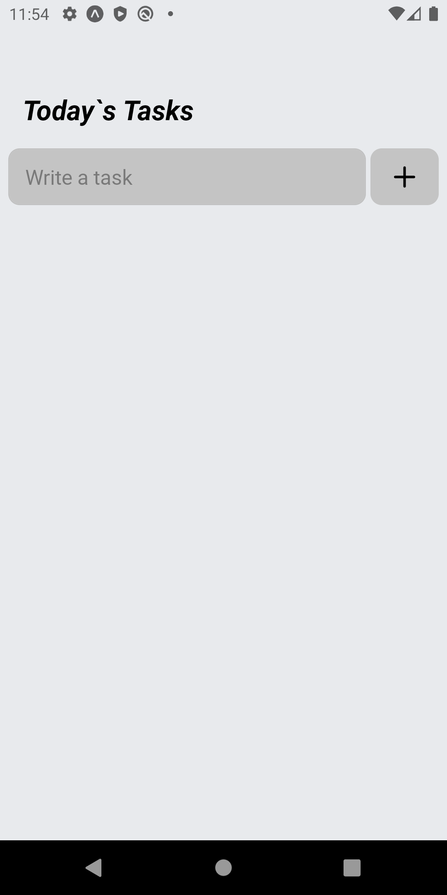
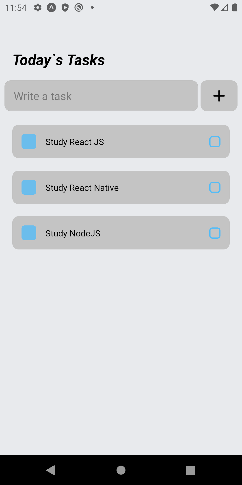

  <h1 align="center">TodoList</h1>

<!-- Getting Started -->

## INICIANDO O PROJETO

Para instalar o projeto em sua maquina siga os passos abaixo.

### INSTALAÇÃO

1. Clone o repositório

   ```sh
   git clone https://github.com/NiloMarcos/AppTodoList.git
   ```

2. Entre na pasta

   ```sh
   cd AppTodoList
   ```

3. Instale as dependências

   ```sh
   yarn
   ```

   ou

   ```sh
   npm i

### Fotos da aplicação

<p align="center">
<table  style="border: none">
  <tr>
    <td>
      
    </td>
    <td>
      
    </td>
  </tr>
</table>
</p>


### Funcionalidades

  <p>
    Um aplicativo para marcar tarefas a serem feitas, apenas coloque a task e clique no " + ", <br/> 
    para salvar a task, caso ja foi concluida apenas clique em cima da mesma, na qual sera <br/> 
    removida no momento clicado.
  </p>